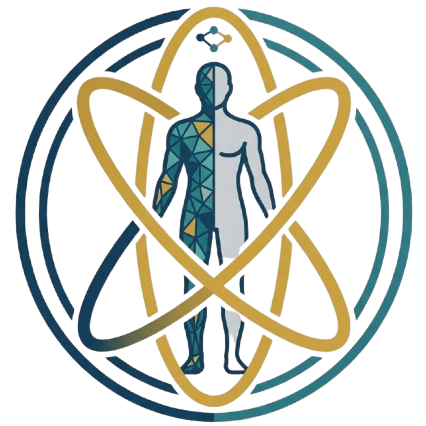
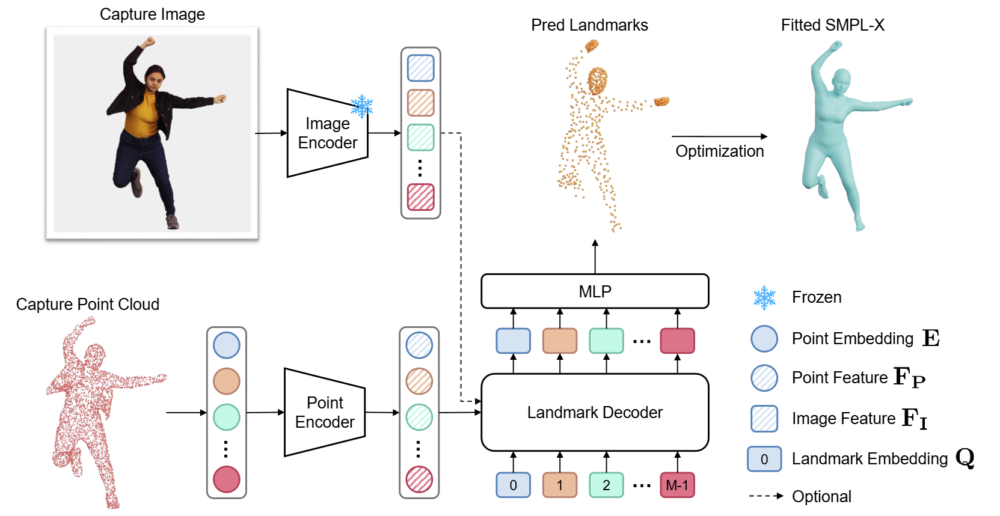

<h2 align="center">
  
  <a href="https://zcai0612.github.io/OmniFit/">OmniFit: Multi-modal 3D Body Fitting via
Scale-agnostic Dense Landmark Prediction</a>
</h2>

[](https://zcai0612.github.io/OmniFit/)
[](https://arxiv.org/abs/2604.21575)
[](https://huggingface.co/Co2y/OmniFit)

[Zeyu Cai](https://zcai0612.github.io/),
[Yuliang Xiu](https://xiuyuliang.cn/),
[Renke Wang](https://scholar.google.com/citations?user=BZG8NcEAAAAJ&hl=en),
[Zhijing Shao](https://initialneil.github.io/),
[Xiaoben Li](https://xiaobenli00.github.io/publications/),
[Siyuan Yu](https://ysysimon.com/),
[Chao Xu](https://scholar.google.cz/citations?user=zlq2S_0AAAAJ&hl=zh-CN&oi=sra),
[Yang Liu](https://scholar.google.cz/citations?user=t1emSE0AAAAJ&hl=zh-CN&oi=sra),
[Baigui Sun](https://scholar.google.cz/citations?user=ZNhTHywAAAAJ&hl=zh-CN),
[Jian Yang](https://scholar.google.cz/citations?hl=zh-CN&user=6CIDtZQAAAAJ),
[Zhenyu Zhang&dagger;](https://jessezhang92.github.io/)

TL;DR: A unified, scale-agnostic 3D human body fitting framework for robustly handling full or partial scans (with or without photos) and AIGC characters.


<video src="assets/OmniFit.mp4" autoplay loop muted playsinline controls width="100%"></video>


## 📢 News

**[2026.06.24]** The inference code and pretrained model weights are released.

**[2026.06.18]** OmniFit has been accepted to **ECCV 2026**.

## ✅ Release Checklist

- [x] Inference code
- [x] Pretrained model weights (4D-DRESS, CAPE, All-in-One Model trained on unified dataset)
- [ ] Training code
- [ ] Unified Synthetic Dataset

## 💡 Overview

<div align="center">
  
</div>


OmniFit supports 3D human fitting from both meshes and point clouds.

Given an input scan, OmniFit:

1. samples or resamples the surface to a fixed number of points;
2. predicts sparse SMPL-X landmarks from point features;
3. optionally uses an image adapter with a provided or rendered front-view image;
4. fits an SMPL-X mesh to the predicted landmarks.


## 📁 Repository Structure

```text
.
├── assets/
├── data/
│   └── smplx_600_landmark_253.json
├── src/
│   ├── models/
│   ├── utils/
│   └── systems/
├── human_models/                 # SMPL-X assets, download separately
├── weights/                      # Model weights, download separately
├── infer.py                      # Main inference script
├── run.sh                        # Example shell script
└── requirements.txt
```

## 🔧 Installation

We recommend using a fresh conda environment.

```bash
conda create -n omnifit python=3.10 -y
conda activate omnifit
```

Install PyTorch and TorchVision according to your CUDA version. For example:

```bash
pip install torch==2.4.1 torchvision==0.19.1 torchaudio==2.4.1 --index-url https://download.pytorch.org/whl/cu118
```

Install the remaining Python dependencies:

```bash
pip install -r requirements.txt
```

Install `theseus` from source:

```bash
git clone https://github.com/facebookresearch/theseus.git
cd theseus
pip install -e .
cd ..
```


## 🤗 Model Weights

Download pretrained OmniFit weights from Hugging Face:

```bash
export HF_ENDPOINT="https://hf-mirror.com" # Optional

hf download Co2y/OmniFit --local-dir tmp # Download Model

mv tmp/weights ./
mv tmp/human_models ./

rm -rf tmp
```

The default inference script expects the all-in-one checkpoint layout:

```text
weights/
├── all_in_one/
│   ├── point_encoder.pt
│   ├── lmk_predictor.pt
│   ├── scale_predictor.pt
│   └── pixel_adapter.pt
├── 4ddress/
│   ├── point_encoder.pt
│   ├── lmk_predictor.pt
│   └── pixel_adapter.pt
└── cape/
    ├── point_encoder.pt
    └── lmk_predictor.pt
```

The ``all-in-one`` model is trained on a unified dataset of 4D-DRESS, CAPE and synthetic scans. It is recommended for general use.

Dataset-specific checkpoints may also be included for validation, such as `weights/4ddress/`
and `weights/cape/`. Please refer to [ETCH](https://github.com/boqian-li/ETCH) for dataset download and validation splits.


## 🚀 Inference

### Mesh Input

```bash
python infer.py \
  --input_path path/to/input.obj \
  --output_dir outputs/mesh_case \
  --with_scale \
  --num_points 15000
```

### Point-Cloud Input

```bash
python infer.py \
  --input_path path/to/input.ply \
  --output_dir outputs/pcd_case \
  --with_scale \
  --num_points 15000
```

### Image-Adapter Inference

Use the image adapter with an explicitly provided image:

```bash
python infer.py \
  --input_path path/to/input.obj \
  --image path/to/front_view.png \
  --output_dir outputs/image_adapter_case \
  --with_scale \
  --with_image_adapter
```

If `--with_image_adapter` is enabled for a mesh input and `--image` is not
provided, OmniFit renders a front-view image with
`src/utils/mesh/common_renderer.py`. The mesh must contain texture or vertex
colors; otherwise rendering raises an error. For point-cloud inputs, please
provide `--image` explicitly.

### Blender-Axis Input

If your input uses Blender coordinates, add:

```bash
--blender_axis
```

## ⚙️ Command-Line Arguments

- `--input_path`: path to input mesh or point cloud
- `--output_dir`: directory for inference outputs
- `--device`: inference device, default `cuda`
- `--num_points`: number of sampled or resampled points, default `15000`
- `--num_betas`: number of SMPL-X shape coefficients, default `10`
- `--with_scale`: enable scale prediction before landmark inference
- `--with_image_adapter`: enable image-adapter landmark prediction
- `--image`: optional RGB/RGBA image for image-adapter inference
- `--blender_axis`: convert Blender coordinates to OpenGL coordinates
- `--point_encoder_ckpt`: point encoder checkpoint path
- `--lmk_predictor_ckpt`: landmark predictor checkpoint path
- `--scale_predictor_ckpt`: scale predictor checkpoint path
- `--image_adapter_ckpt`: image adapter checkpoint path
- `--lmk_json_file`: SMPL-X landmark definition file

## 📚 Citation

If you find OmniFit useful for your research, please cite:

```bibtex
@inproceedings{cai2026omnifit,
  title={{OmniFit: Multi-modal 3D Body Fitting via Scale-agnostic Dense Landmark Prediction}},
  author={Cai, Zeyu and Xiu, Yuliang and Wang, Renke and Shao, Zhijing and Li, Xiaoben and Yu, Siyuan and Xu, Chao and Liu, Yang and Sun, Baigui and Yang, Jian and Zhang, Zhenyu},
  booktitle={{The European Conference on Computer Vision (ECCV)}},
  year={2026}
}
```

## 🙏 Acknowledgements

We thank the authors of the following works, whose ideas and open-source implementations form the foundation of this project:

+ [SMPL-X](https://github.com/vchoutas/smplx), [VGGT](https://github.com/facebookresearch/vggt), [MV-Adapter](https://github.com/huanngzh/MV-Adapter), [MAMMA](https://github.com/cuevhv/mamma), [ETCH](https://github.com/boqian-li/ETCH)

## 📄 License

This project is released for academic, non-commercial research use only. Please
see [LICENSE](LICENSE) and follow the licenses of SMPL-X and all third-party
dependencies.
